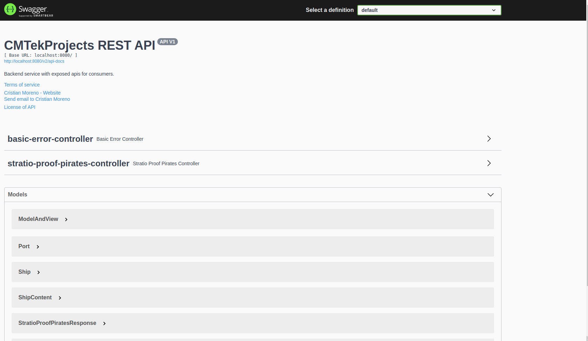

# Getting Started

### Reference Documentation
This service is based in spring-boot. The result is exposed way API REST and can be consumed for third party software or for frontend services, that can print result in a single page.

### Run Application
Select StratioProofPiratesApplication and Run As java application or spring-boot-app. This will serve a Tomcat Server
in localhost:8080.

### Getting Fibonaccie Serie
There is a servlet controller, that will give you the following information:

    - Know all the travel history of a ship or port and filter it by event type.
    - Know the current stock of a Port.
    - Reconstruct the diary log of a port of the designed system in the event the informationshould be stollen.
    
### Swagger API Specification
Swagger2 is integrated with this service, allowing check API specification in easy and smart way. For access
please follow the link http://localhost:8080/swagger-ui/.

### Docker deployment
The service is encapsulated in a docker container.

1. Build docker image
    - docker build -t stratio-pirate-service-backend .
2. Run docker image 
    - docker run -p 8080:8080 stratio-pirate-service-backend

